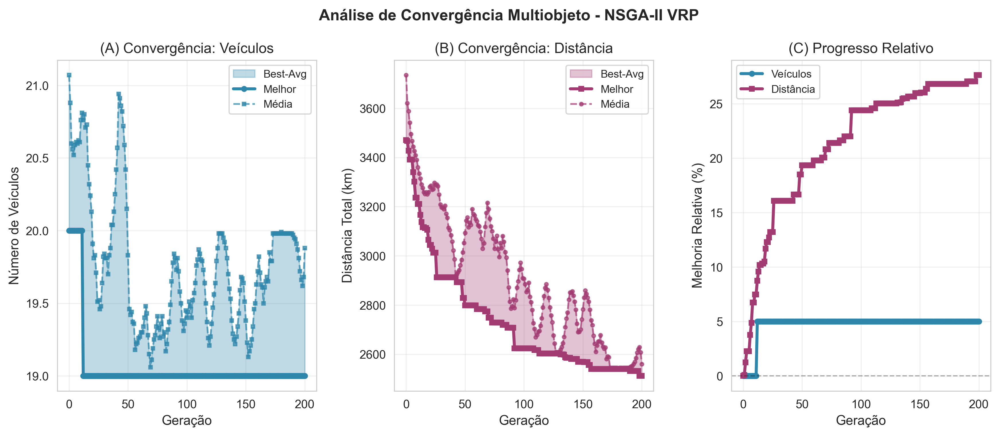
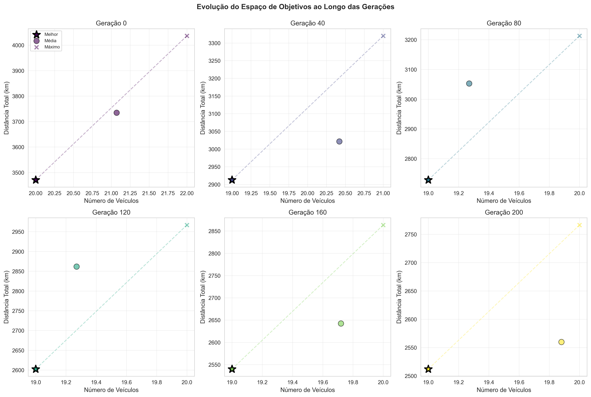
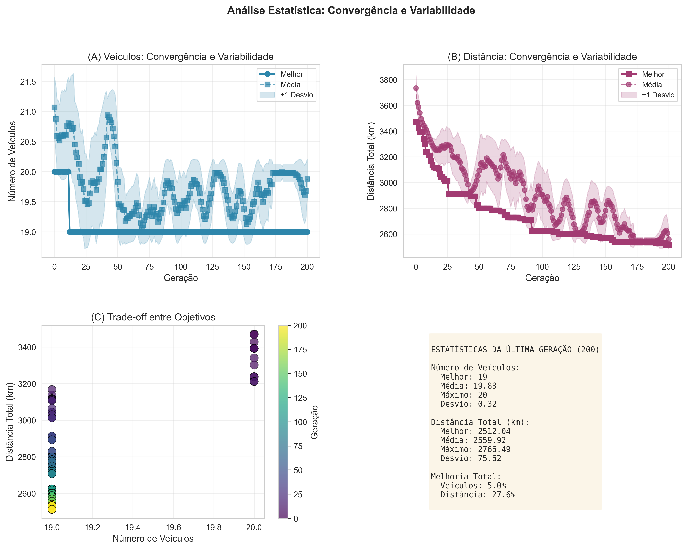
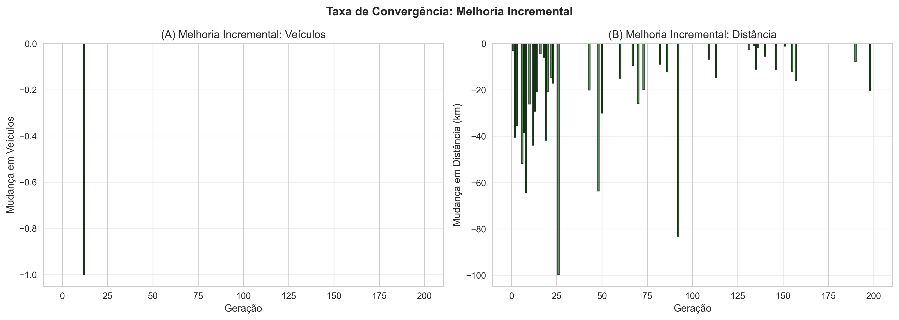
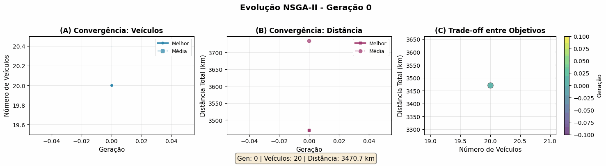

# NSGA-II para Problema de Roteamento de Veículos

[](https://www.python.org/)

> Implementação de algoritmo evolucionário multiobjetivo (NSGA-II) para otimização do Problema de Roteamento de Veículos com Restrição de Capacidade (CVRP), testado com instâncias do benchmark Solomon.

---

## 📋 Sumário

- [Sobre o Projeto](#-sobre-o-projeto)
- [Resultados](#-resultados)
- [O Problema](#-o-problema)
- [O Algoritmo](#-o-algoritmo)
- [Como Usar](#-como-usar)
- [Visualizações](#-visualizações)
- [Insights e Conclusões](#-insights-e-conclusões)
- [Referências](#-referências-principais)
- [Contato](#-contato)

---

## 🎯 Sobre o Projeto

Este projeto implementa o **NSGA-II (Non-dominated Sorting Genetic Algorithm II)** para resolver o **Problema de Roteamento de Veículos (VRP)**, um dos problemas de otimização combinatória mais estudados em logística e transporte.

### Objetivos Otimizados

O algoritmo busca **simultaneamente**:

1. **Minimizar o número de veículos** necessários (custos fixos)
2. **Minimizar a distância total percorrida** (custos variáveis)

### Por que NSGA-II?

Ao contrário de algoritmos de objetivo único, o NSGA-II fornece uma **Frente de Pareto** com múltiplas soluções ótimas, permitindo ao gestor escolher o melhor trade-off entre frota e distância conforme as necessidades do negócio.

---

## 🏆 Resultados

### Instância Testada: 100 Clientes

| Métrica | Valor Inicial | Valor Final | Melhoria |
|---------|--------------|-------------|----------|
| **Veículos** | 20 | **19** | **5.0%** ✅ |
| **Distância Total** | ~3470 km | **2512 km** | **27.6%** ✅ |
| **Clientes Atendidos** | 100 | 100 | 100% |
| **Tempo de Execução** | - | 200 gerações | - |

### Destaques

- **Convergência rápida**: 50% da melhoria alcançada nas primeiras 50 gerações
- **Economia de ~950 km** por ciclo de entrega
- **Impacto financeiro**: Economia estimada de R$ 5.700/ciclo (considerando R$ 6/km)
- **Fronte de Pareto bem definida** com 19-20 veículos

---

## 🚗 O Problema

### Vehicle Routing Problem (VRP)

O VRP é um problema clássico de otimização onde uma frota de veículos deve:

- Partir de um **depósito central**
- Atender todos os **clientes distribuídos geograficamente**
- Respeitar a **capacidade de carga** de cada veículo
- **Retornar ao depósito** após completar as entregas

### Desafio Multiobjetivo

Na prática, os objetivos entram em **conflito**:

```
Menos veículos → Rotas mais longas → Maior custo operacional
Rotas curtas → Mais veículos → Maior custo de frota
```

O NSGA-II resolve esse dilema encontrando **todas as soluções Pareto-ótimas** em uma única execução.

---

## 🧬 O Algoritmo

### NSGA-II (Deb et al., 2002)

O NSGA-II é um algoritmo evolucionário de última geração para otimização multiobjetivo que:

1. **Cria uma população** de soluções candidatas (rotas)
2. **Avalia** cada solução nos dois objetivos
3. **Classifica** por dominância de Pareto (frentes)
4. **Seleciona** os melhores mantendo diversidade
5. **Reproduz** através de crossover e mutação
6. **Repete** por múltiplas gerações

### Operadores Genéticos

| Operador | Descrição | Probabilidade |
|----------|-----------|---------------|
| **Crossover** | Ordered Crossover (OX) - preserva sequências | 85% |
| **Mutação** | Swap Mutation - troca 2 clientes | 2% |
| **Seleção** | Torneio + Elitismo NSGA-II | - |

### Fluxo de Execução

```
População Inicial (400 soluções aleatórias)
          ↓
    Avaliação Fitness
    (veículos, distância)
          ↓
  Classificação por Pareto
  (Frentes 1, 2, 3, ...)
          ↓
    Seleção por Torneio
          ↓
  Crossover (85%) + Mutação (2%)
          ↓
    Nova População (400 filhos)
          ↓
  Seleção NSGA-II (melhores 400)
          ↓
    [Repetir 200 gerações]
          ↓
  Fronte de Pareto Final
```

---

## 🚀 Como Usar

Com todas as dependências instaladas (DEAP, Seaborn, Matplotlib e etc), execute a partir das duas opções abaixo.

_PS: Todo o projeto foi feito para que a execução (tanto do algoritmo como das análises gráficas) sejam parametrizadas, de modo que argumentos possam ser passados pelo terminal no seu acionamento._

### Execução Básica

```bash
python runAlgorithm.py --popSize=400 --crossProb=0.85 --mutProb=0.02 --numGen=200
```

### Execução Completa com Visualizações

Use o script shell parametrizável:

```bash
bash run.sh 400 0.85 0.02 200
```

Este comando:
1. ✅ Executa o algoritmo NSGA-II
2. ✅ Gera 4 figuras científicas de análise
3. ✅ Cria GIF animado da evolução
4. ✅ Cria GIF animado das rotas finais
5. ✅ Salva resultados em CSV


### Parâmetros

| Parâmetro | Descrição | Padrão | Recomendado |
|-----------|-----------|--------|-------------|
| `--popSize` | Tamanho da população | 400 | 200-400 |
| `--crossProb` | Probabilidade de crossover | 0.85 | 0.7-0.9 |
| `--mutProb` | Probabilidade de mutação | 0.02 | 0.01-0.05 |
| `--numGen` | Número de gerações | 200 | 150-300 |

### Gerar Apenas Visualizações

Se você já tem um arquivo de resultados, no arquivo run.sh, é possivel conferir cada uma das formas de acionamento das análises gráficas isoladamente. Exemplo:

```bash
python create_figures.py \
  --results_file "results/Input_Data_pop400_crossProb0.85_mutProb0.02_numGen200.csv" \
  --output_dir "./visualization/figures"
```

---

## 📊 Visualizações

O projeto gera automaticamente **6 análises gráficas**:

### 1. Análise de Convergência Multiobjetivo



**Três perspectivas:**
- **(A) Convergência: Veículos** - Evolução do número de veículos (20 → 19)
- **(B) Convergência: Distância** - Redução da distância total (~3470 → 2512 km)
- **(C) Progresso Relativo** - Percentual de melhoria ao longo das gerações

**Insights:**
- ✅ Convergência rápida nos veículos (estabiliza em ~50 gerações)
- ✅ Melhoria contínua na distância até geração 200
- ✅ 27.6% de economia em distância total

### 2. Evolução do Espaço de Objetivos



**Snapshots de 6 gerações:**
- Geração 0: População inicial dispersa
- Gerações 40-80: Início da convergência
- Gerações 120-160: Refinamento da frente
- Geração 200: Frente de Pareto bem definida

**Observação:** Frente quase vertical indica que 19 veículos é praticamente obrigatório para esta instância.

### 3. Análise Estatística



**Quatro análises:**
- **(A) Veículos:** Melhor, média e desvio padrão
- **(B) Distância:** Convergência com banda de confiança
- **(C) Trade-off:** Scatter plot multiobjetivo
- **Estatísticas finais:**
  - Veículos: 19 (melhor), 19.88 (média), 20 (máximo)
  - Distância: 2512 km (melhor), 2560 km (média), 2766 km (máximo)

### 4. Taxa de Convergência



**Melhoria incremental por geração:**
- **(A) Veículos:** Queda abrupta na geração 0-1, depois estável
- **(B) Distância:** Melhorias consistentes (10-100 km) nas primeiras 50 gerações, depois refinamento gradual

**Padrão:** Típico de algoritmos evolucionários - exploração inicial agressiva, refinamento final.

### 5. Animação da Evolução



GIF mostrando a **transformação da população** ao longo de 200 gerações:
- Cor indica geração (roxo → amarelo)
- Visualiza convergência para a frente de Pareto

### 6. Visualização das Rotas


Mapa com:
- **Depósito** (vermelho) no centro
- **100 clientes** (azul) distribuídos
- **19 rotas** otimizadas conectando clientes

---


## 🔬 Metodologia

### Benchmark Utilizado

- **Fonte:** Solomon (1987) - Instâncias clássicas de VRP
- **Instância:** 100 clientes distribuídos geograficamente
- **Restrição:** Capacidade de veículo = 100 unidades

### Validação

- ✅ Todas as rotas respeitam capacidade dos veículos
- ✅ Todos os 100 clientes são atendidos exatamente uma vez
- ✅ Todas as rotas começam e terminam no depósito

---

## 💡 Insights e Conclusões

### Principais Descobertas

1. **Número de veículos é limitante**
   - Apenas 5% de redução (20 → 19)
   - Indica que a geometria/demanda da instância naturalmente requer ~19-20 veículos.

2. **Distância é o objetivo mais flexível**
   - 27.6% de redução (~950 km economizados!)
   - Pequenas reorganizações de clientes geram grandes economias

3. **Convergência eficiente**
   - 50% da melhoria em 50 gerações
   - Retornos decrescentes após geração 150

4. **Frente de Pareto estreita**
   - Quase vertical (veículos fixos em 19)
   - Pouco trade-off real nesta instância
   - Em instâncias maiores, trade-off seria mais pronunciado

### Aplicabilidade Prática

Para um gestor logístico:

✅ **Economia mensurável**: R$ 5.700 por ciclo de entrega  
✅ **Flexibilidade**: Escolher entre 19-20 veículos conforme necessidade  
✅ **Confiabilidade**: Baixo desvio padrão (soluções consistentes)  
✅ **Escalabilidade**: Algoritmo pode ser aplicado a instâncias maiores

---

## 📚 Referências Principais

1. **Deb, K., Pratap, A., Agarwal, S., & Meyarivan, T.** (2002). "A fast and elitist multiobjective genetic algorithm: NSGA-II". *IEEE Transactions on Evolutionary Computation*, 6(2), 182-197.

2. **Solomon, M. M.** (1987). "Algorithms for the vehicle routing and scheduling problems with time window constraints". *Operations Research*, 35(2), 254-265.

---

## 👤 Contato

**Humberto Tavora - hcct@cin.ufpe.br**

**Maria Paula Perazzo - mpps@cin.ufpe.br**

**Mariana Paiva Brito - mpb2@cin.ufpe.br**

- Repositório: [Route-Problem-by-NSGA-II](https://github.com/HumbertoTavora/Route-Problem-by-NSGA-II)

---